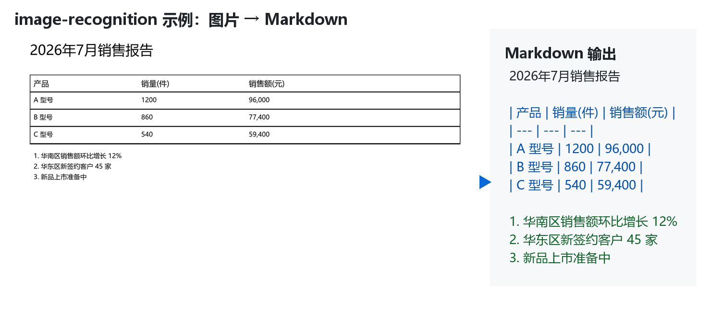

# image-recognition Skill

> 🖼️ AI 图像识别 Skill（非 OCR）—— 把图片一键转为排版一致的 Markdown

调用本地视觉大模型（VLM），自动缩放图片并发送给 OpenAI 兼容的 `/v1/chat/completions` 接口，返回完整内容的 Markdown 文本。适用于**截图、文档扫描件、图表、表格、海报、界面、照片**等图片的语义识别。

## ✨ 效果示例



> 输入一张销售报表截图，模型在数秒内识别出标题、Markdown 表格和有序列表，排版与原图保持一致。

## 特性

- ✅ **自动缩放**：最长边 ≤ 1280px（LANCZOS 高质量，自动修正 EXIF 旋转、透明底垫白）
- ✅ **本地推理**：图片不上传云端，隐私安全
- ✅ **通用接口**：兼容任何 OpenAI 兼容的视觉 API（Ollama、LM Studio、vLLM 等）
- ✅ **智能探测**：未指定模型时通过 `/v1/models` 自动选择视觉模型
- ✅ **可配置**：API 地址 / 模型 / 提示词支持命令行、环境变量、配置文件三级覆盖
- ✅ **轻量依赖**：只需 `pillow` + `requests` 两个常用包

---

## 📋 前置依赖（必装）

使用本 Skill 需要准备三样东西：**本地视觉服务**、**视觉模型**、**Python 环境**。

### 1. 本地视觉服务（Ollama 推荐）

| 推荐 | 端口 | 适用系统 |
|---|---|---|
| **Ollama**（首选，开箱即用） | 11434 | Windows / macOS / Linux |
| LM Studio | 1234 | Windows / macOS |
| vLLM / 自建服务 | 自定 | Linux 为主 |

#### 安装 Ollama

- **下载**：访问 [https://ollama.com/download](https://ollama.com/download)，下载 Windows 安装包 `OllamaSetup.exe`（约 1.5GB）并双击安装。
- **验证**：安装完成后，打开终端执行 `ollama --version`，看到版本号（如 `ollama version is 0.32.5`）即成功。
- **启动**：Ollama 安装后会作为后台服务自动启动并开机自启，监听 `127.0.0.1:11434`。无需手动 `ollama serve`。

> 💡 国内网络下载慢的用户：可使用 GitHub 加速镜像（如 `https://ghproxy.net/`、`https://github.moeyy.xyz/` 等）下载安装包，或在浏览器下载后放入任意目录。

### 2. 视觉模型

Ollama 安装好后，拉取一个视觉模型（VLM）。推荐 `qwen2.5vl:3b`（轻量、4~6GB 显存即可流畅运行）：

```bash
ollama pull qwen2.5vl:3b
```

模型文件约 2~3GB，首次拉取需要几分钟。

**其他可选模型**（按需选择）：

| 模型 | 大小 | 显存需求 | 适用 |
|---|---|---|---|
| `qwen2.5vl:3b` | ~3.2GB | ≥ 6GB | **日常推荐**（截图/文档/表格） |
| `qwen2.5vl:7b` | ~6GB | ≥ 10GB | 更高精度 |
| `llava:7b` | ~4.7GB | ≥ 8GB | 备选 |
| `minicpm-v` | ~5GB | ≥ 8GB | 备选 |

**验证模型就绪**：

```bash
ollama list
```

应能看到 `qwen2.5vl:3b` 出现在列表中。

### 3. Python 环境

需要 **Python 3.10+**，并安装两个依赖包：

```bash
# 如果已有 Python 环境
pip install pillow requests

# 建议用虚拟环境隔离（推荐）
python -m venv .venv
.venv\Scripts\activate     # Windows
source .venv/bin/activate  # macOS / Linux
pip install pillow requests
```

**验证依赖**：

```bash
python -c "import PIL, requests; print('OK')"
```

---

## 📦 安装 Skill

把整个 `image-recognition/` 文件夹复制到目标机器的技能目录：

| 目标应用 | 技能目录位置 |
|---|---|
| **WorkBuddy（用户级）** | `~/.workbuddy/skills/` |
| **Claude Code** | `~/.claude/skills/` 或项目 `.claude/skills/` |
| 其他遵循 Agent Skills 规范的应用 | 同理 |

例如在 WorkBuddy 中：

```bash
cp -r image-recognition ~/.workbuddy/skills/
```

完成后，在对话中直接说"**识别这张图片**"或"**把图转成 Markdown**"即可触发。

---

## 🚀 使用方式

### 命令行直接调用

```bash
python scripts/recognize_image.py <图片路径>

# 常用参数
python scripts/recognize_image.py "C:\path\to\image.png" \
    --model qwen2.5vl:3b \
    --output result.md

# 仅自检图片预处理（不调用 API）
python scripts/recognize_image.py "image.png" --dry-run
```

### 通过 AI 对话触发

把 `image-recognition/` 文件夹放到 Skills 目录后，在 AI 对话中：

1. 上传一张图片（或粘贴路径）
2. 说「**识别这张图**」「**把图转成 Markdown**」「**提取图片内容**」等
3. AI 会自动调用本 Skill，返回排版一致的 Markdown

---

## ⚙️ 配置

配置优先级：**命令行参数 > 环境变量 > `config.json` > 内置默认值**

| 配置项 | 环境变量 | 默认值 | 说明 |
|---|---|---|---|
| API 基础地址 | `VISION_API_BASE` | `http://127.0.0.1:11434` | 拼接 `/v1/chat/completions` |
| 模型名 | `VISION_MODEL` | 自动探测 | 留空时从 `/v1/models` 选视觉模型 |
| 默认提示词 | `VISION_PROMPT` | 识别图片里所有信息，使用 markdown 输出全部内容，并保持排版的一致 | 输出风格控制 |
| 最大边长 | — | `1280` | 图片缩放后最长边像素 |
| 最大输出 token | — | `4096` | 模型回复上限 |

示例：使用 LM Studio 替代 Ollama：

```bash
export VISION_API_BASE=http://127.0.0.1:1234
python scripts/recognize_image.py image.png
```

---

## ❓ 故障排查

| 现象 | 可能原因 | 解决 |
|---|---|---|
| `Connection refused` | 本地视觉服务未启动 | 检查 Ollama 是否运行；或执行 `ollama serve` |
| `未找到可用模型` | 模型未拉取或服务里没视觉模型 | `ollama pull qwen2.5vl:3b`；或 `--model` 显式指定 |
| `HTTP 4xx` | API 地址/端口不对 | 确认 `config.json` 中 `api_base` 与服务端口一致 |
| 推理速度慢 | 首次加载模型 + 图片过大 | 正常；后续推理秒级；可调小 `--max-size` |
| 显存不足（OOM） | 模型过大 | 换更小的模型（如 3b）；或关闭其他占显存程序 |

---

## 📂 目录结构

```
image-recognition/
├── SKILL.md               # 技能定义（触发词 + 使用流程）
├── config.json            # 默认配置
├── README.md              # 本文件
└── scripts/
    └── recognize_image.py # 核心脚本
```

---

## 🤝 与其它视觉服务搭配

`config.json` 改一下 `api_base` 即可对接任何 OpenAI 兼容服务：

- **Ollama**：`http://127.0.0.1:11434`（默认）
- **LM Studio**：`http://127.0.0.1:1234`
- **vLLM 自建**：`http://your-server:8000`
- **云端 API**（如通义千问 VL、智谱 GLM-4V）：填厂商提供的 `base_url` + API Key（需改脚本加鉴权头）

---

## 📄 License

MIT
